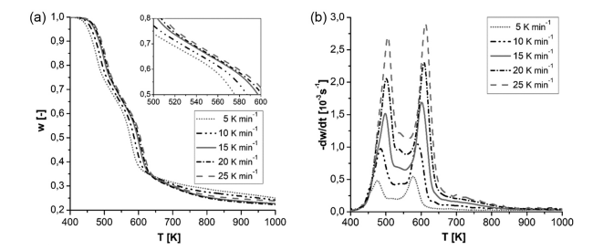
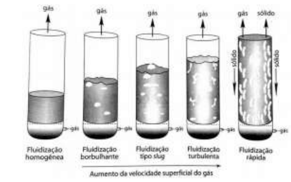




# PYROLYSIS KINETICS FOR LIGNOCELLULOSIC SORGHUM: THERMOGRAVIMETRIC DATA ANALYSIS FOR FRIEDMAN MODEL APPLICATION

The reference text investigates the pyrolysis kinetics of lignocellulosic sorghum, a renewable resource with potential for biofuel production. The study employs thermogravimetric analysis (TGA) to examine the thermal decomposition of sorghum biomass under slow pyrolysis conditions. The Friedman model is applied to determine kinetic parameters, notably the activation energy, crucial for understanding the reaction pathways and optimizing pyrolysis processes. A custom algorithm is developed to enhance the accuracy of kinetic parameter calculations by mitigating the influence of experimental noise in TGA data. The findings contribute valuable insights into the pyrolysis behavior of lignocellulosic sorghum, aiding in the development of sustainable energy solutions and biorefinery processes.

**Relevance to Data Science and Analytics:**

This research exemplifies the application of data science and analytics in the field of renewable energy. It showcases the following key aspects:

1.  **Data Collection and Preprocessing:** The study involves collecting experimental data through thermogravimetric analysis (TGA). The data preprocessing step, including noise reduction and smoothing techniques, is crucial to ensure data quality and reliability for subsequent analysis.
2.  **Algorithm Development:** A custom algorithm is designed to address the specific challenges posed by experimental noise in TGA data, demonstrating the ability to develop tailored solutions for data analysis tasks.
3.  **Kinetic Modeling:** The Friedman model is employed to analyze the pyrolysis kinetics, highlighting the use of mathematical models to understand and predict complex processes.
4.  **Data Visualization:** The research utilizes graphs and plots to present experimental results and model predictions, effectively communicating findings and facilitating interpretation.
5.  **Application to Renewable Energy:** The study's focus on lignocellulosic sorghum for biofuel production underscores the role of data science in advancing sustainable energy solutions and addressing environmental challenges.

Incorporating this research into your portfolio showcases your proficiency in data analysis, algorithm development, and modeling, particularly within the context of renewable energy and sustainability. It highlights your ability to apply data science techniques to real-world challenges and contribute to the development of innovative solutions. 
Please check it at the following link. PS: The Main language of the article is Portuguese-Brazil: [PYROLYSIS KINETICS FOR LIGNOCELLULOSIC SORGHUM: THERMOGRAVIMETRIC DATA ANALYSIS FOR FRIEDMAN MODEL APPLICATION](https://matheushbps.github.io/files/cinetica_artigo.pdf)

# MODELING AND SIMULATION OF SERIAL ELUTRIATORS USING SCILAB

The reference article delves into the modeling and simulation of elutriators, which are industrial separation units used to segregate particles based on their size and density differences. The research employs Scilab, a numerical computation software, to simulate a series of three elutriators handling particles of varying densities. The study systematically investigates the impact of key parameters like fluidization velocity, flow rate, and an empirical exponent (alpha) on the elutriation process. The core objective is to optimize these parameters to achieve efficient separation of particles within the elutriator system.

**Relevance to Data Science and Analytics**

This research exemplifies a practical application of data science and analytics within the realm of chemical engineering. Here's a breakdown of the key connections:

* **Mathematical Modeling and Simulation**: The article constructs a mathematical model to represent the complex fluid dynamics and particle behavior within the elutriator system. This model serves as a virtual laboratory where experiments can be conducted efficiently and cost-effectively.
* **Parameter Optimization**: The study explores the parameter space by systematically varying key variables. This approach aligns with the data science practice of hyperparameter tuning, where the goal is to discover the optimal configuration that maximizes the performance of a model or system.
* **Data Visualization**: The results are presented graphically, showcasing the impact of parameter changes on system behavior. Effective data visualization is crucial in data science for communicating insights and patterns hidden within the data.
* **Process Optimization**: Ultimately, the research aims to identify the ideal operating conditions for the elutriator system. This directly translates to process optimization in industrial settings, a common goal in data science projects aimed at improving efficiency and productivity.
Please check it at the following link. PS: The Main language of the article is Portuguese-Brazil: [MODELING AND SIMULATION OF SERIAL ELUTRIATORS USING SCILAB](https://matheushbps.github.io/files/elutriacao_artigo.pdf)
