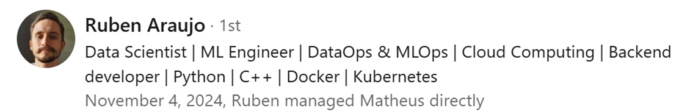


<!--  -->

Matheus, in my opinion, is an honest worker. He is knowledgeable about the subjects he has expertise in, is diligent, punctual and a friendly data scientist. I hired him to teach me some skills and I liked the way how he teaches practically and in an engaging and relevant manner. I intend to keep working with Matheus in the future.

___

I had the pleasure of leading a small team where Matheus was a standout contributor. From our very first interaction, it was clear that he is one of the most dedicated professionals I've worked with. Matheus consistently goes above and beyond to help the team meet and exceed its goals. His eagerness to learn, curiosity, and disciplined work ethic set him apart, making him not only a key player but also a dependable technical anchor for the team. Matheus is a tremendous asset to any organization.

___

Matheus supported our team with important analyses for strategic business decisions.  
Very collaborative, he demonstrates high expertise with databases, SQL, and agility.

___

I mentored Matheus, and he showed a strong desire to learn, develop, and seek knowledge (including through the mentorship) to improve himself not only technically but also with a business perspective. He is very focused and always eager to contribute. His curiosity is a great asset that will certainly benefit any work he undertakes.

___

Matheus served as a data analyst for my team. His ability to build dashboards and automate reports/routines improved work efficiency for internal stakeholders and supported decision-making.

___

Matheus possesses both data analytical skills and database structure knowledge. He was a vital asset in developing management tools such as scorecards and dashboards.  
He demonstrates a high capacity for execution, being both quick and effective in his deliveries.

___

I had the pleasure of working closely with Matheus for 1 year at DiDi global. He consistently demonstrated exceptional teamwork skills and a strong aptitude for technical tasks, particularly in SQL database management and automated reporting.

Mat possesses an impressive ability to collaborate effectively within a team, fostering a cohesive environment where ideas flow freely and projects progress smoothly. He actively contributed to group discussions, offering valuable insights and solutions that greatly benefited our team's objectives.

Furthermore, showcased remarkable proficiency in SQL database management, effectively designing and generating databases that efficiently stored and managed large volumes of data. He demonstrated a keen attention to detail, ensuring data integrity and optimizing database performance to meet project requirements.

Additionally, excelled in developing automated reporting systems, streamlining processes and significantly reducing manual workload. He leveraged his technical expertise to create robust reporting mechanisms that provided actionable insights to stakeholders in a timely manner.

Overall, Matheus is a dedicated team player with a strong technical acumen, making him a valuable asset to any organization. I highly recommend Him for any role that requires a combination of teamwork skills and technical proficiency, particularly in SQL database management and automated reporting.I had the pleasure of working closely with Matheus for 1 year at DiDi global. He consistently demonstrated exceptional teamwork skills and a strong aptitude for technical tasks, particularly in SQL database management and automated reporting. Mat possesses an impressive ability to collaborate effectively within a team, fostering a cohesive environment where ideas flow freely and projects progress smoothly. He actively contributed to group discussions, offering valuable insights and solutions that greatly benefited our team's objectives. Furthermore, showcased remarkable proficiency in SQL database management, effectively designing and generating databases that efficiently stored and managed large volumes of data. He demonstrated a keen attention to detail, ensuring data integrity and optimizing database performance to meet project requirements. Additionally, excelled in developing automated reporting systems, streamlining processes and significantly reducing manual workload. He leveraged his technical expertise to create robust reporting mechanisms that provided actionable insights to stakeholders in a timely manner. Overall, Matheus is a dedicated team player with a strong technical acumen, making him a valuable asset to any organization. I highly recommend Him for any role that requires a combination of teamwork skills and technical proficiency, particularly in SQL database management and automated reporting.

