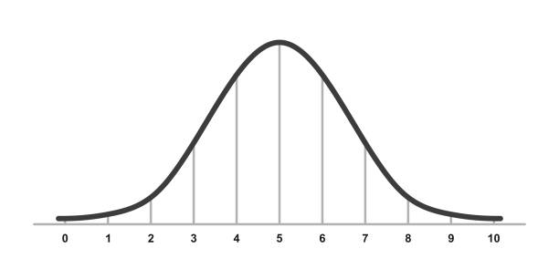




# Tableau Tutoring Experience

I had the opportunity to provide comprehensive Tableau classes to a student based in the USA. The curriculum covered a wide range of topics, starting with an introduction to the Tableau interface and its core functionalities. We then delved into data manipulation techniques, including filtering, joining datasets, and creating calculated fields to derive meaningful insights. 

The student also gained hands-on experience in crafting various visualizations, from commonly used charts to impactful annotations, enabling them to build compelling data stories. Recognizing the importance of a strong foundation, I also incorporated basic statistical concepts, differentiating between categorical and numerical variables and exploring essential data aggregation methods like mean, median, and standard deviation. This knowledge empowers the student to create a broader spectrum of visualizations and analyses.

The final phase of the tutoring focused on synthesizing the acquired skills. The student learned how to assemble visualizations into cohesive stories that effectively communicate findings to an audience. Additionally, we explored the creation of interactive dashboards, enabling real-time data tracking and metric monitoring.

**Student Testimonial:**

> *“Matheus, in my opinion, is an honest worker. He is knowledgeable about the subjects he has expertise in, is diligent, punctual and a friendly data scientist. I hired him to teach me some skills and I liked the way how he teaches practically and in an engaging and relevant manner. I intend to keep working with Matheus in the future.”*

This experience underscores my ability to not only share technical knowledge but also to create a positive and effective learning environment. I'm passionate about empowering others to harness the power of data visualization and analysis. 

_____

# Statistical Analysis and Tutoring Experience

In addition to my data visualization and Tableau expertise, I've had the privilege of assisting two students with their statistical analysis needs.

* **Chi-Square Test Implementation:** I collaborated with a student on her research article, implementing chi-square tests to assess the statistical significance of data collected through surveys. The study investigated the impact of Games/Social Media and Television on student performance. Through this analysis, we were able to statistically demonstrate that students who spent a significant amount of time (more than 3 hours daily) on these activities tended to have lower grades.

* **Biostatistics Tutoring:** I provided guidance to a Nutrition student who was grappling with the application of statistics in her field. I explained the concept of the Normal distribution and how to interpret p-values in the context of null and alternative hypotheses. This helped her gain a deeper understanding of the relevance and importance of statistics within her course and future career.

These experiences highlight my ability to not only apply statistical methods effectively but also to communicate complex concepts in a clear and understandable manner. I'm passionate about helping others develop their statistical literacy and appreciate the role of data analysis in various fields. 
